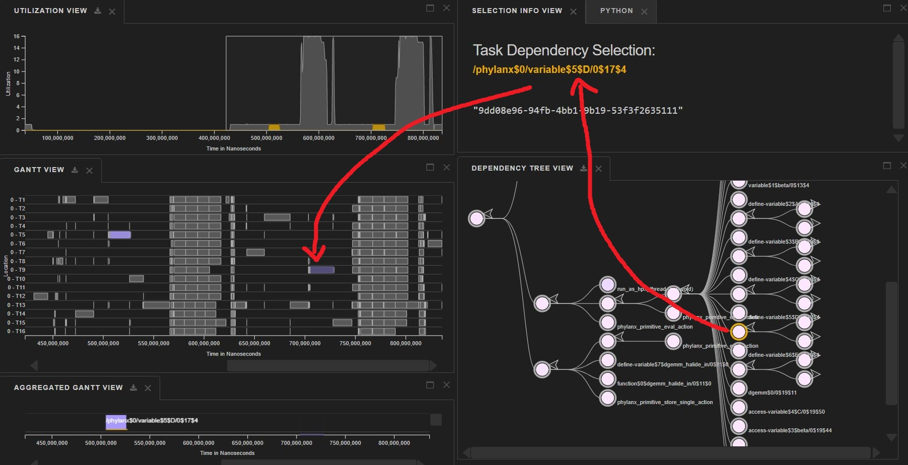

### Findings Summary

- There seems to be a serialization in loading the variables. (These are shown in analysis 1 and 2)
- The CPU thread utilization never exceeds 2.0 (These are shown in analysis 3 and 4)

### How I built Phylanx with Halide

Using HPX git commit # `295b5f82cc39925a0d53e77ba3b6d02a65204535` 

and Phylanx git commit # `dc79a36c922087edf2653fae5d0f2dd72706ab3b`,

and then by mostly following [Rod's](https://github.com/rtohid/scripts/blob/master/build/rostam/build_phylanx_halide.sh) script, I built Phylanx with halide. 

### Analysis 1 (dgemm)
I run [this python](FinalRunWithHalide/sayef_halide_in.py) program and generated OTF2 data and visualized in Traveler. I noticed that, for the second function 
halide_dgemm_in, it takes some time to load the variables A,B, and C. Check the purple bars in the Gantt View of these figures. I used red arrows to 
annotate over these images. 

### Analysis 2 (dgemm)
I run [this python](Analysis3/sayef_multi_in.py) program and generated OTF2 data and visualized in Traveler. Here, I added two more variables `D` and `E` 
inside the `sayef_multi_in.py` function (at line number 17, 18). Then in the visualization, I noticed additional two synchronous executions (total 5, 
for the Sample Run and Observation 1, it was 3).
Check the purple bars in the Gantt View of these figures,

### Analysis 3 (ALS)
I run [this python](ALS/phylanx_als_csv.py) program and generated OTF2 data and visualized in Traveler. I noticed that max CPU thread utilization is roughly 
1.5. I am started wondering, maybe most variables are being loaded serially here, even if I have multiple available unused threads.

### Analysis 4 (kmeans)
I run [this python](kmeans/kmeans.phylanx.py) program and generated OTF2 data and visualized in Traveler. I noticed that max CPU thread utilization is roughly 
2.0. In the following figure, I used 8 threads,

In the following figure, I used 16 threads,

Noticing that, even if I increased total thread counts, max CPU thread utilization doesn't change. Total execution time using 16 threads is 0.37 seconds, 
using 8 threads is 0.25 (got these values from the console output).