Sample Tasks to explore Traveler
================================

### Some miscellaneous information
Primitives are The function calls, control flow operations, data operations, and blocks. Phylanx primitive name pattern can be found 
[here](https://github.com/STEllAR-GROUP/phylanx/blob/master/phylanx/execution_tree/compiler/primitive_name.hpp#L20-L43). For example: 
- `/phylanx$0/function$0$dgemm_halide_in/0$11$0` means, the function with name `dgemm_halide_in` at line number 11 and column number 0 executed at core 
location 0.
- `/phylanx$0/variable$3$B/0$15$4` means, the variable with name `B` at line number 15 and column number 4 executed at core location 0.

### Some sample tasks to get familiar with the interface
- Task 1: Find the starting time of task execution related to function `dgemm_halide_in`.
- Task 2: Find the primitive name for the task execution with most occurrence.
- Task 3: Pinpoint variable `A,B,C` instantiation time.

[comment]: <> (&#40;You might want to try doing these tasks in your own before reading through the following description&#41;)
### Task 1
The following picture is the first page when visiting [Traveler](https://traveler-integrated.herokuapp.com) with the default provided dataset. Reload it to 
make it look like as follows,
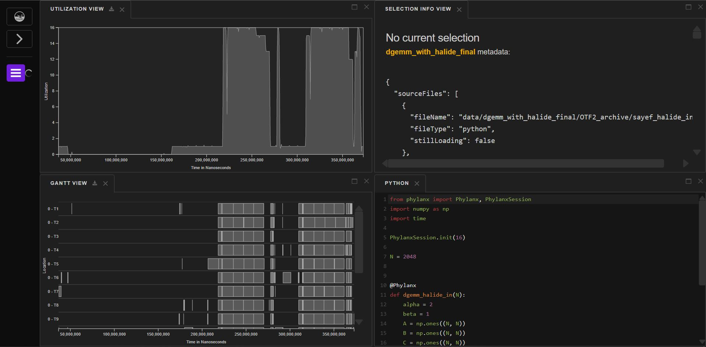
#### Step 1
Randomly clicking on the interval bars in the **Gantt View**(bottom-left) and notice their primitive names from the **Selection Info View**(top-right). 
Conclusion: Most interval bars belongs to the primitive `halide_hpx_for`. Their immediate parent (following the yellow line) is somewhere after location 0-T9.
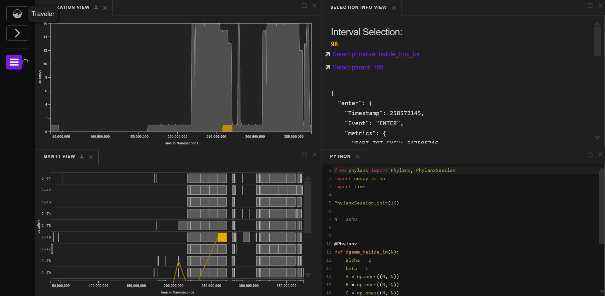
#### Step 2
Click and drag on the **gantt view** vertically to make all parents visible.
Conclusion: Following along the parent intervals, the root parent started somewhere between time 150M and 200M nanoseconds
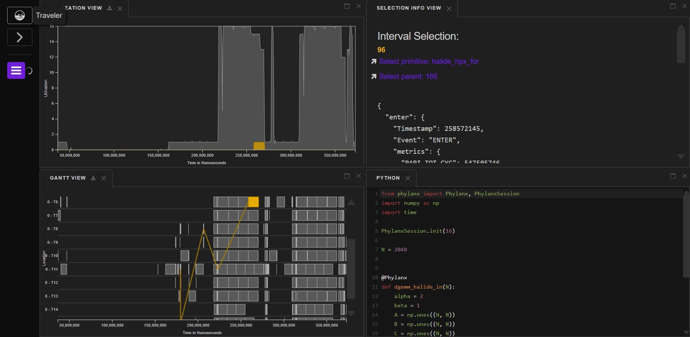
#### Step 3
Start scrolling on the **gantt view** to zoom in to the root parent task. Notice that the brush in the **utilization view** is also being updated as you 
are scrolling in the **gantt view**. Try dragging the left or right edge of the brush  in the **utilization view** to zoom in faster.
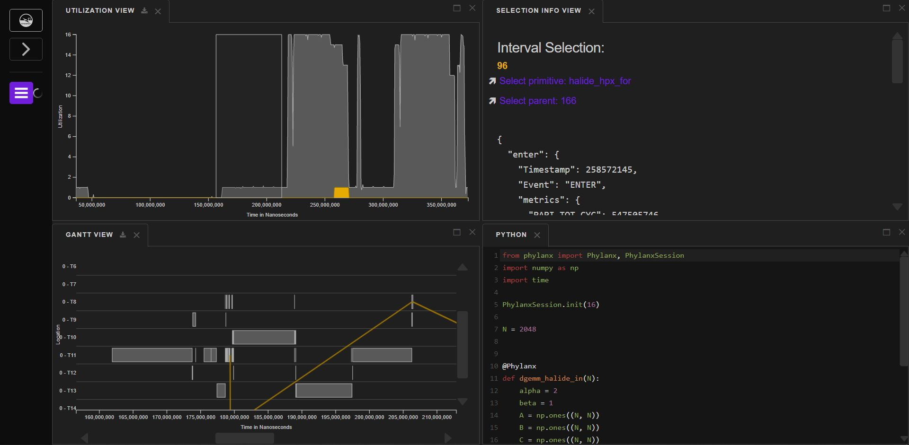
Conclusion: Found the task which is causing all the other executions.
#### Step 5
Click on that task to highlight it.
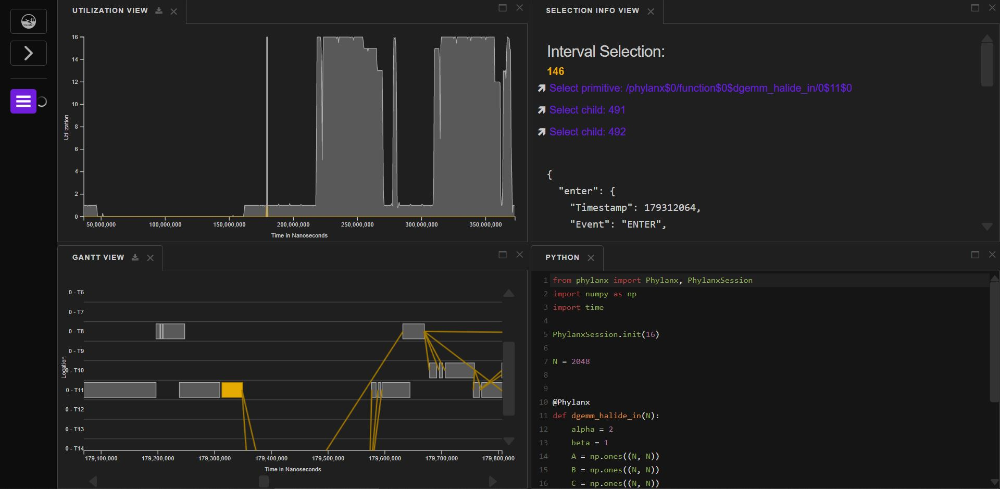
Conclusion: Notice its name in the **Selection Info View**. It is `/phylanx$0/function$0$dgemm_halide_in/0$11$0`. We have found the task related to the 
function `dgemm_halide_in`. Notice its line number and column number from the **Code View**. It is at line 11 column 0, which is also consistent with the 
primitive name

### Task 2
The following picture is the first page when visiting [Traveler](https://traveler-integrated.herokuapp.com) with the default provided dataset. Reload it to
make it look like as follows,

#### Step 1
Randomly clicking on the interval bars in the **Gantt View**(bottom-left) and notice their primitive names from the **Selection Info View**(top-right).
Conclusion: Most interval bars belongs to the primitive `halide_hpx_for`.

#### Step 2
Scroll in the y-axis of the **gantt view** to zoom out and show all the locations at once.
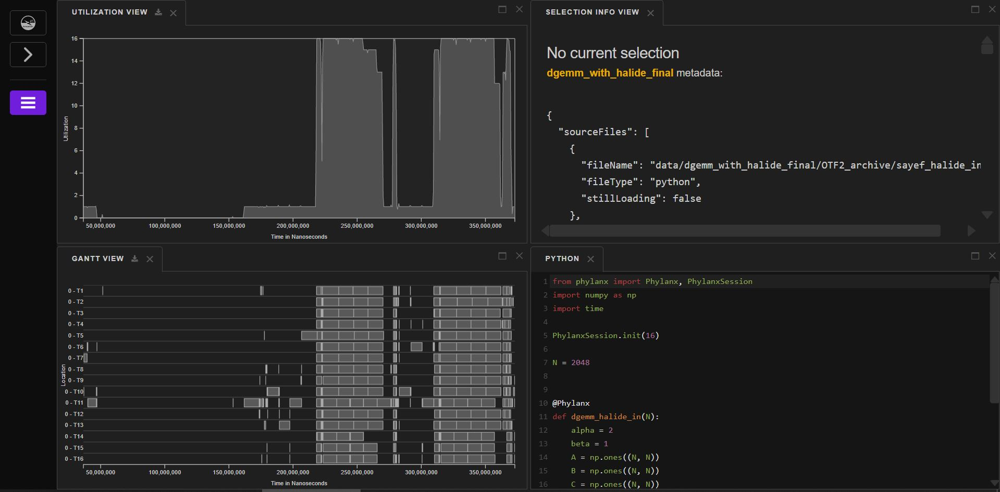

#### Step 3
Click through the hamburger menu->OPEN VIEW->INTERVAL HISTOGRAM.
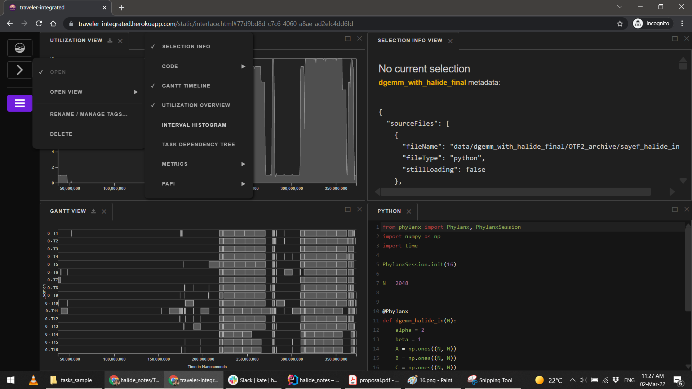

#### Step 4
Click on the drop down menu at the bottom of the **interval histogram view**. Choose `halide_hpx_for`.
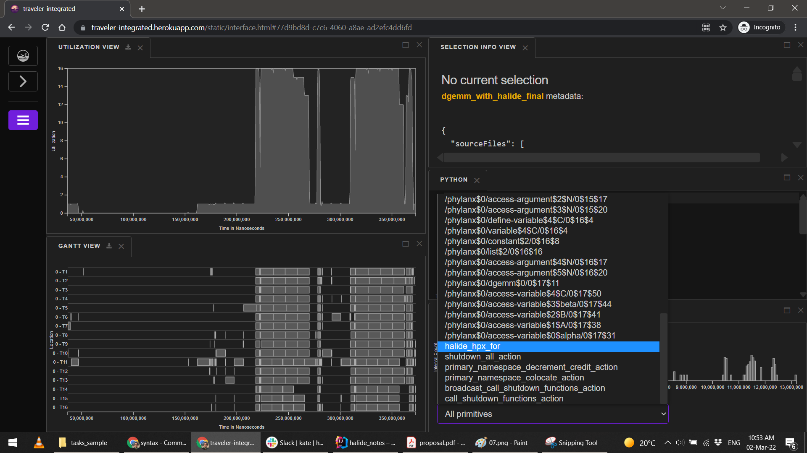

#### Step 5
Click and Drag over the **interval histogram view**. Notice that, some interval bars in the **gantt view** are started getting highlighted with yellow 
color.
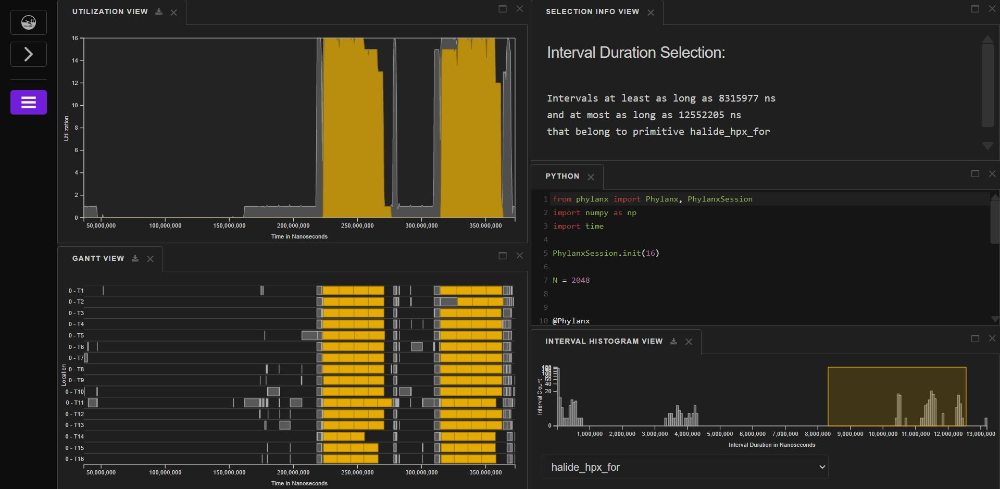

#### Step 6
In the **interval histogram view**, drag the left edge of the brush all the way to the left. Similarly, drag the right edge to all the way to the right.
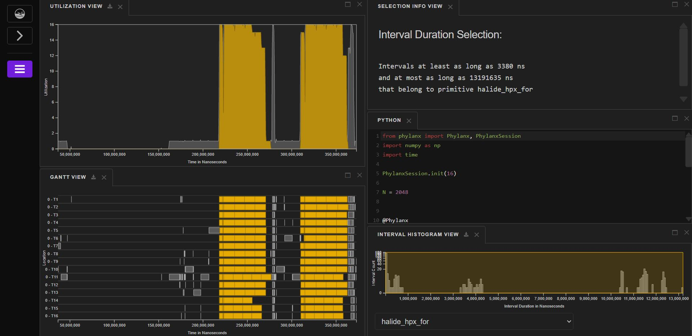

Conclusion: All the interval bars are highlighted for the primitive `halide_hpx_for`. In the utilization view, it is also getting highlighted for the most 
of the part. Therefore, `halide_hpx_for` is the primitive with most occurrences of task execution.

### Task 3
The following picture is the first page when visiting [Traveler](https://traveler-integrated.herokuapp.com) with the default provided dataset. Reload it to
make it look like as follows,

#### Step 1
Browse the **code view**.
Conclusion: There are total 6 variables used by the function `dgemm_halide_in` - `alpha, beta, A, B, C, N`.

#### Step 2
Click through the hamburger menu->OPEN VIEW->TASK DEPENDENCY TREE. Re-organize the sub-windows in the right to make it look like as follows,
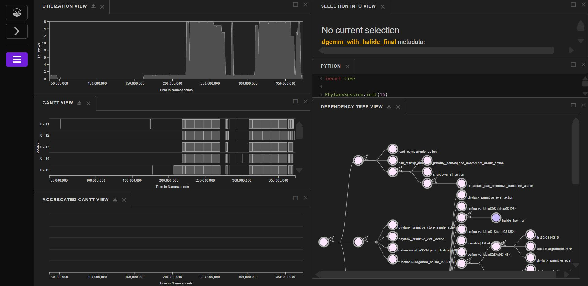

#### Step 3
Find the node with the name `/phylanx$0/function$0$dgemm_halide_in/0$11$0` and click on it.
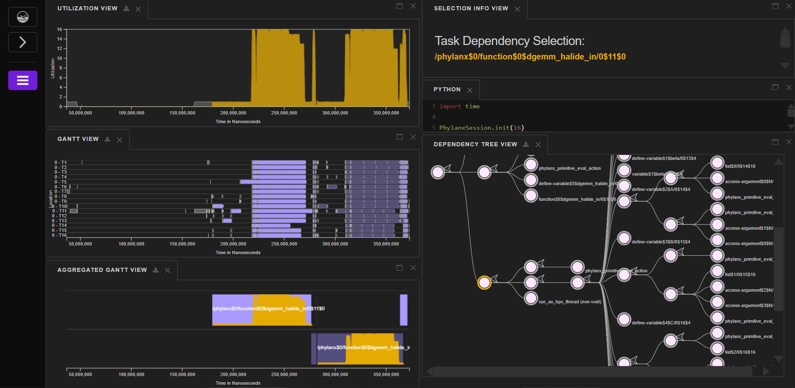
Conclusion: All the interval bars are highlighted in the **gantt view**. **Utilization view** is also highlighted. There are roughly 4-6 bars in the 
**aggregated gantt view** (there might be some smaller ones too small for being noticeable). Therefore, this function block is roughly being execution 4-6 
times.

#### Step 4
Find primitive `/phylanx$0/variable$2$A/0$14$4` to find all tasks related to instantiating variable `A`.
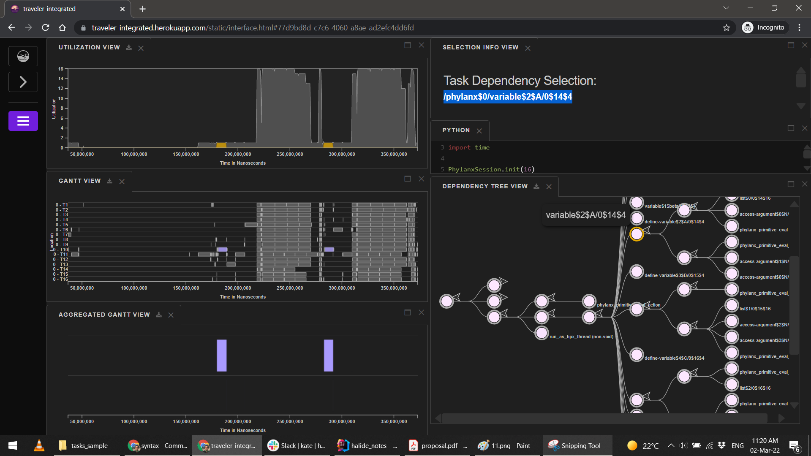
Conclusion: Roughly 2 noticeable bars in the **aggregated gantt view**. Notice the associated bars in the **gantt view** also. It is making sense, since the 
`dgemm_halide_in` function was being called twice, from line number 19 and 22.

#### Step 5
Find primitive `/phylanx$0/variable$3$B/0$15$4` to find all tasks related to instantiating variable `B`.
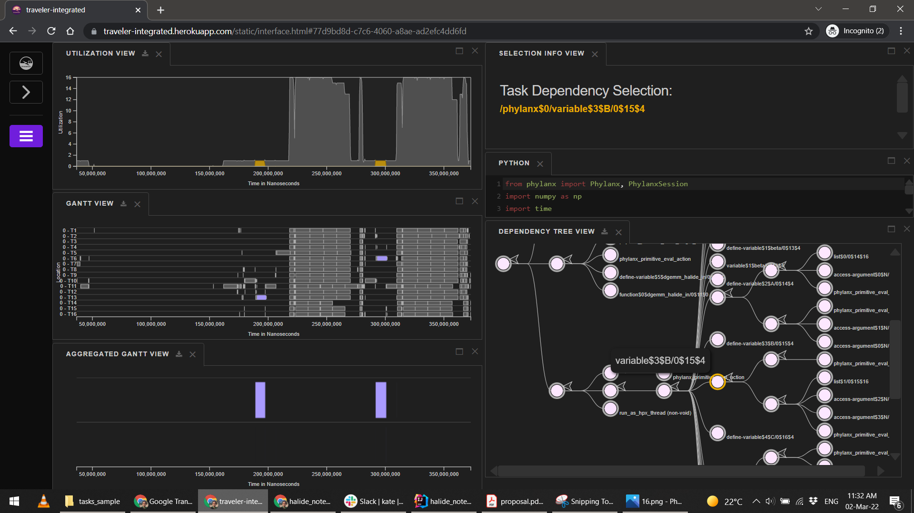
Conclusion: Roughly 2 noticeable bars in the **aggregated gantt view**. Notice the associated bars in the **gantt view** also.

#### Step 6
Find primitive `/phylanx$0/variable$4$C/0$16$4` to find all tasks related to instantiating variable `C`.

Conclusion: Roughly 2 noticeable bars in the **aggregated gantt view**. Notice the associated bars in the **gantt view** also.

Final Conclusion: These three variables `A,B,C` are being loaded synchronously which is conspicuous from their execution bar in the **gantt view**