Traveler Features
==========================

An illustrative video can be found [here](https://www.dropbox.com/s/hx3gjpbwnyrwkz5/TravelerIntro.mp4?dl=0).

### Available Views

- Timeline Views 
  - Gantt View
  - Utilization View
  - Functional Box Plot View
  - Line Chart View
  - Aggregated Gantt View
- Ancillary views
  - Interval Histogram View
  - Dependency Tree View
- Informative Views
  - Selection Info View
  - Code View

### Introduction
Traveler is an integrated visualization system for asynchronous multitask execution. It is hosted at this link https://traveler-integrated.herokuapp.com. 
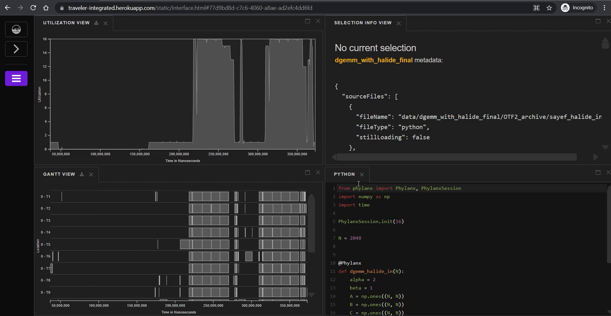

In this figure, execution data from a [sample](https://github.com/sayefsakin/halide_notes/blob/master/FinalRunWithHalide/sayef_halide_in.py) [Phylanx](https://github.com/STEllAR-GROUP/phylanx/) program, written in python, has been visualized in Traveler. Here, at the bottom right, the program is presented in the **Code View**. This program uses 16 threads to execute the function.

### Gantt View
At the bottom left is the **Gantt View**. Here at x-axis is time in nanoseconds. The y-axis represents CPU core and threads 
presented as `core number-thread number`. For example, `0-T1` in the top row represents CPU core number 0 and thread number T1. This view shows a task 
execution as an interval using a rectangle. Clicking on an interval bar will highlight that with yellow color. For example, in the following figure, the 
highlighted yellow bar represents a task execution at CPU core 0 and thread location T-1 started at roughly 258M nanoseconds and ended at time roughly 272M 
nanoseconds.
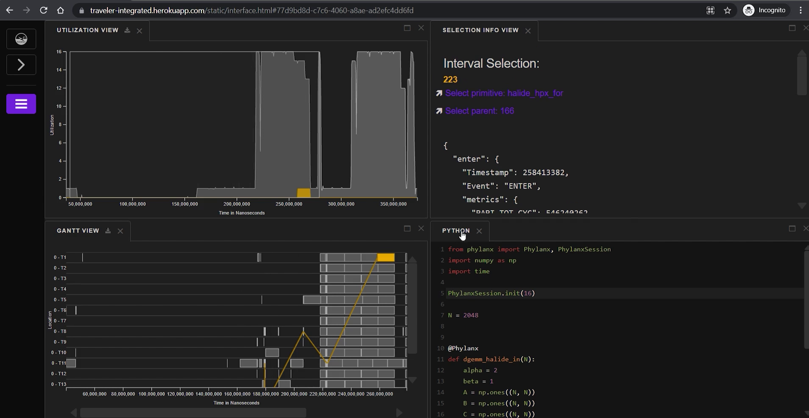
Its possible to zoom in and zoom out by scrolling in the gantt view. Scrolling in the y-axis will zoom vertically over the CPU core-thread locations. It 
also supports panning by clicking and dragging in both horizontally and vertically. The yellow lines represent parent-child dependency. For example the task 
`halide_hpx_for` is initiated by the task `/phylanx$0/variable$0$alpha/0$12$4`. It is possible to follow along the parent and show its other dependencies.
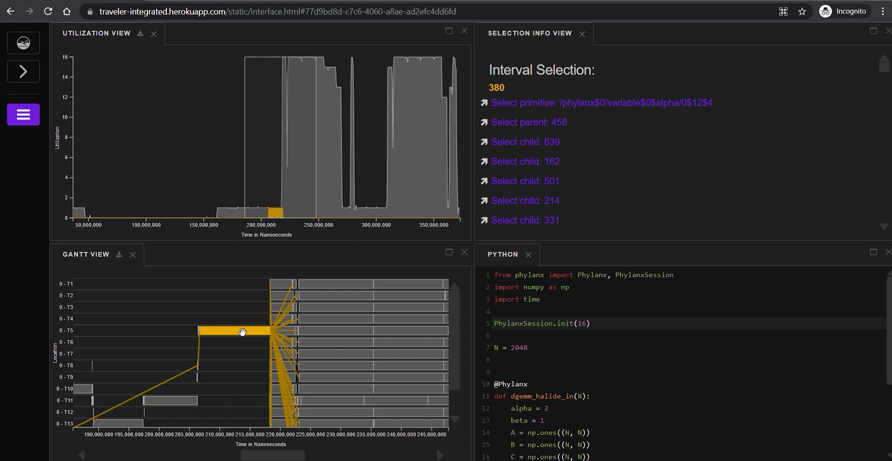

### Utilization View
At the top left is the **Utilization View**, which shows among the 16 CPU threads, how much are being utilized at a time. Here, the x-axis represents time
in nanoseconds. It supports brush drawing, by mouse click-hold-drag-release, to highlight a specific time in this view. The gantt view (and 
other timeline views) will update accordingly. It is also possible to drag a previously drawn brash horizontally.

### Selection Info View
At the top-right is the **Selection Info View**. It is showing all the related information of the execution. Clicking on an interval bar in the gantt view will 
highlight (in yellow color) that interval bar in the **gantt view** and corresponding utilization in the **utilization view**. The **Selection Info View** will show 
its relevant information. 

### Functional Box Plots and Line Chart
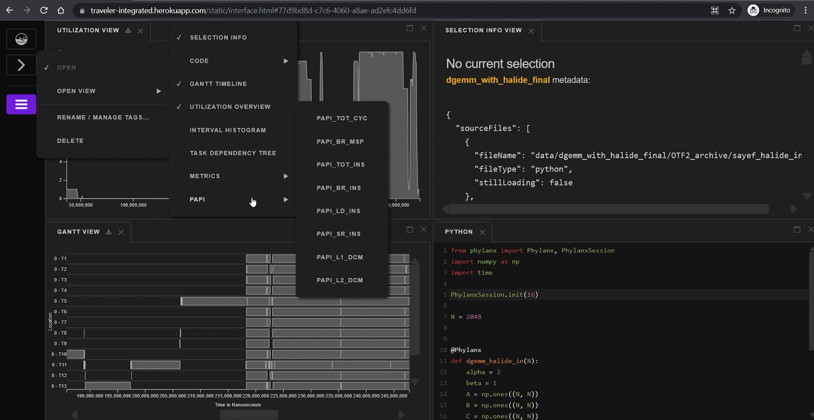
Traveler also has other types of views. Clicking on the hamburger menu in the left pane and then hovering over **OPEN VIEW** will show all the available views. 
Clicking on **OPEN VIEW->PAPI->PAPI_TOT_CYC** will bring a new view at the bottom left (see the following figure).
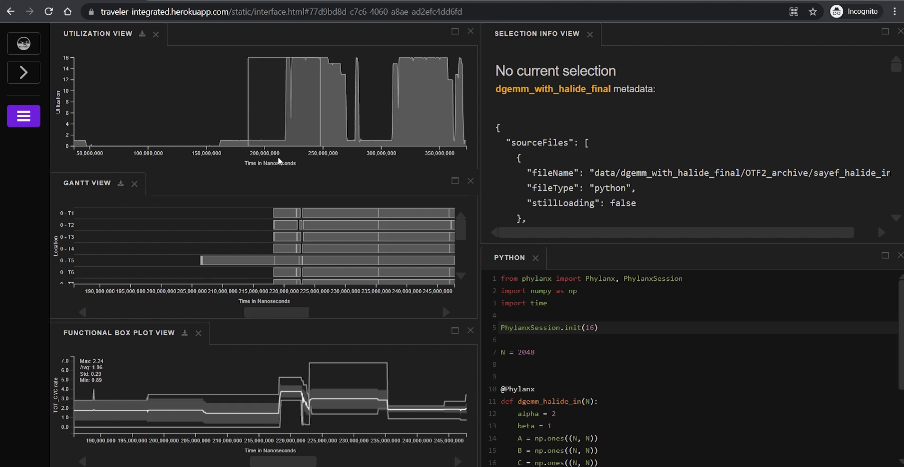
This view is showing [PAPI](https://tvm.apache.org/docs/how_to/profile/papi.html) metric data **PAPI_TOT_CYC** (total CPU cycle) as a rate. For a consecutive 
(time1, value1) and (time2, value2) pairs where time1 > time2, the rate is calculated,

It is represented as a functional box plots, where the top line represents the maximum value, the bottom one is the minimum, and the middle one is the average. 
The shaded gray area around the average line is the 1 standard deviation. Traveler also supports other types of metrics like **CPU IDLE %** (the next picture). 
These timeline views also support zoom in/out and panning. These are also linked with the gantt and utilization view.
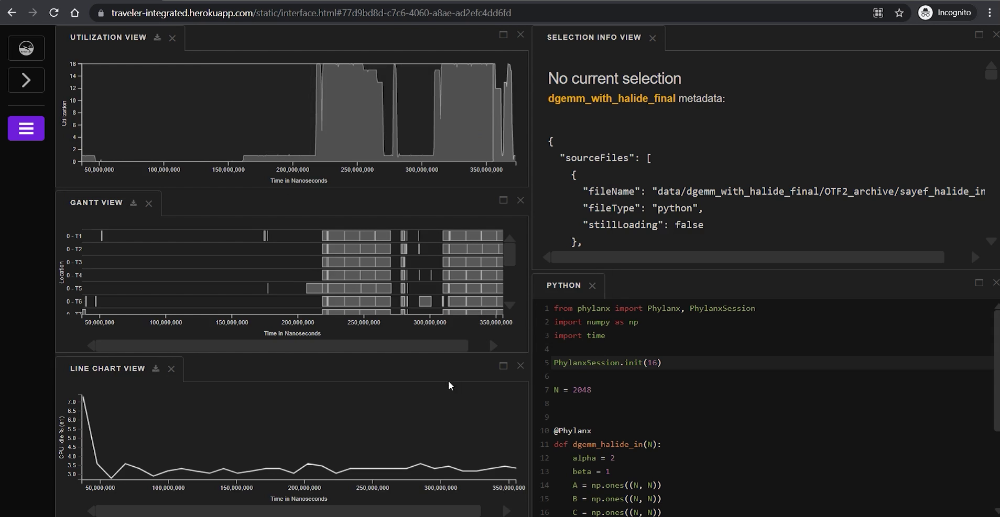

### Interval Histogram View
From the hamburger menu in the left pane, clicking through **OPEN VIEW->INTERVAL HISTOGRAM** will show up the **Interval Histogram View** (bottom-right in 
the following picture)
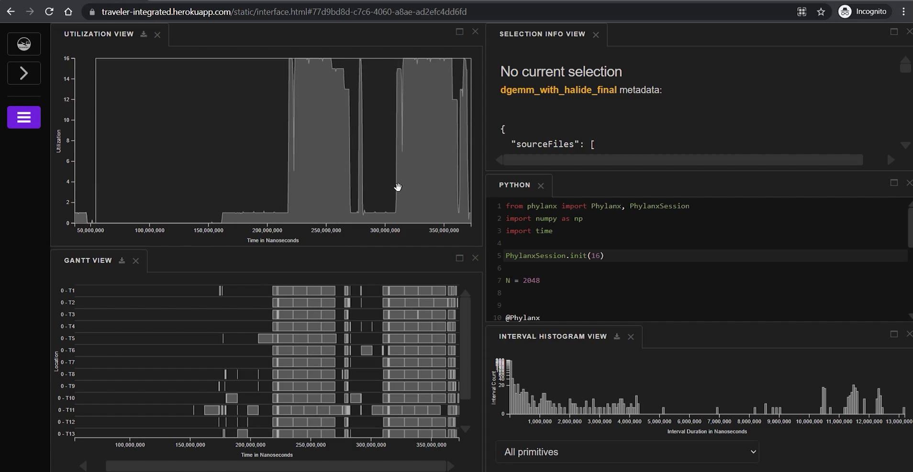
This view is showing how many intervals are there of a specific duration or length. Here, the y-axis shows the count and x-axis is the durations. It is 
possible to click and drag a brush in this view, and consequently in the gantt view, it will highlight all the interval bars having length within the 
brushed duration. The highlighting in the utilization view also gets updated. With this, it is possible to find out the longest interval bars, as well as 
the shortest ones. (see the following picture)
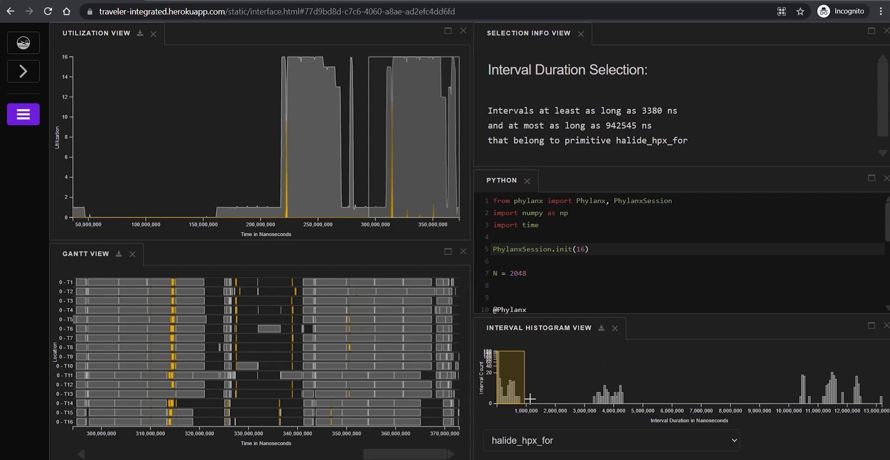

### Task Dependency Tree
From the hamburger menu in the left pane, clicking through **OPEN VIEW->TASK DEPENDENCY TREE** will bring two interfaces--**Dependency Tree View** and 
**Aggregated Gantt View**.
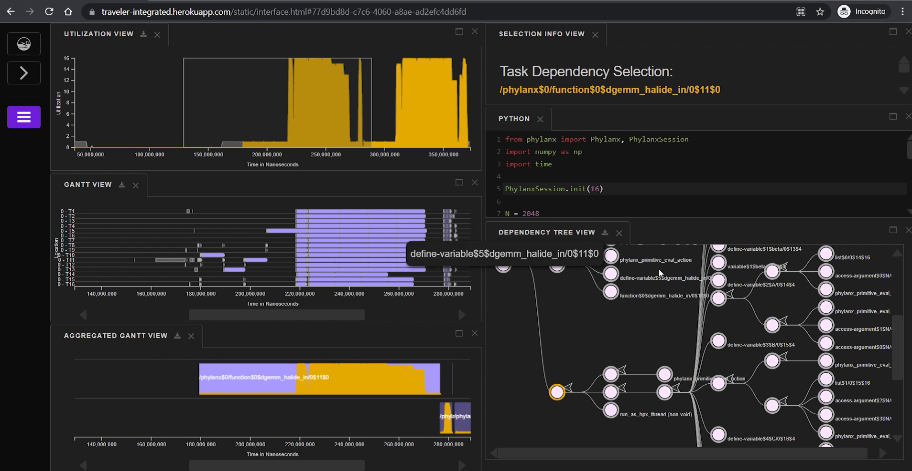
Here at the bottom-right is the **dependency tree view**. As a reminder, There could be a dependency between some tasks, like a function calls to another 
function and it could be instrumented as a parent child relationship between these tasks (yellow lines in the **gantt view**). The task dependency tree 
basically shows this parent-child relationship as a tree and makes it easier to navigate through each task. Now, if we aggregate tasks by the subtree rooted 
at a specific node, we could visualize that using an ancillary **aggregated gantt view** (at the bottom-left). Here, It shows a single aggregated rectangle 
to represent all such dependent tasks which gets aggregated by the subtree. Clicking on different nodes in the task dependency tree will show the 
aggregated tasks in the **aggregated gantt view**, highlight the related interval bars in the **gantt view** and update highlighting in the 
**utilization view**. In the **dependency tree view**, clicking on the left arrow icon will collapse the subtree into a single node (associated node of the clicked arrow) and 
turn that arrow into a right arrow. (top node in the 2nd column from the left of the following picture).
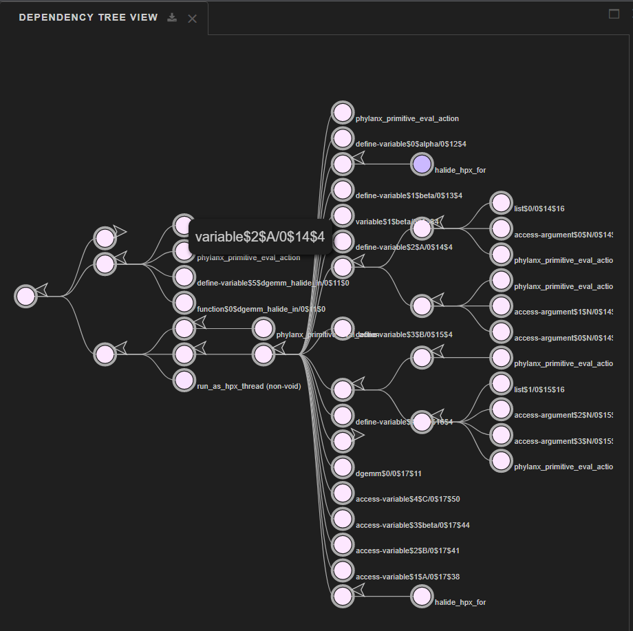

Clicking on the right arrow will expand and show all the nodes in the subtree rooted at the associated node.
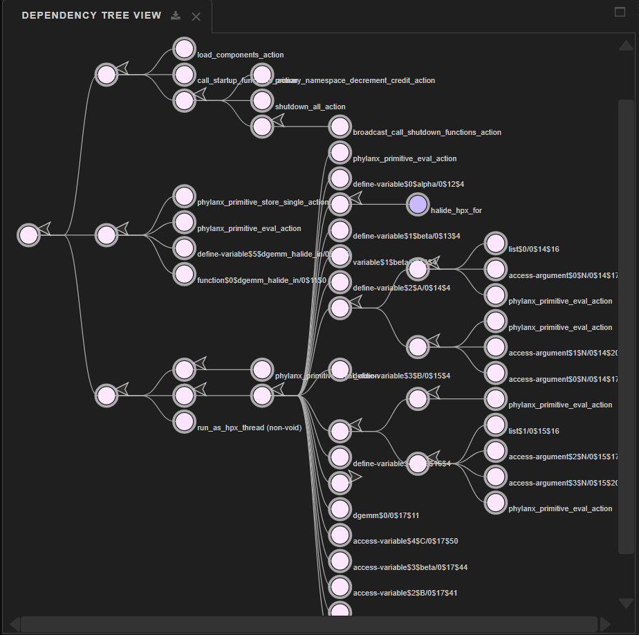

Hovering over each node will show the associated task name. Nodes are shaded according to their total occurrence count (darker for higher occurrences). 
Notice, the `halide_hpx_for` has darker blue color compared to other nodes which indicates that that task has higher occurrence in the execution. 

In the **aggregated gantt view**, overlapped aggregated bars are presented with an additional row and color coded with different shades of purple color. 
Interval bars in the **gantt view** are also being colored with the same shade of purple corresponding to the aggregated bar (to which these bars belong to) in 
the **aggregated gantt view**. The task name is also written with each aggregated bar and associated CPU utilization is drawn within the aggregated bar.